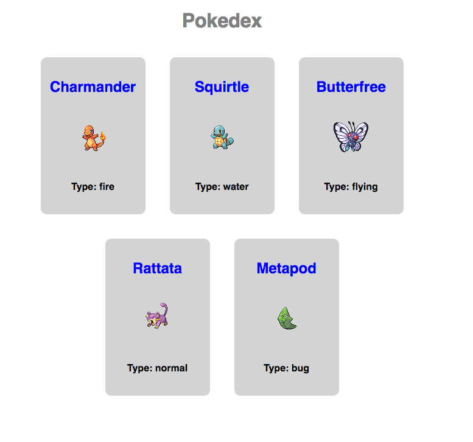

## Props Exercises

Create a pokemon application (a pokedex) that displays an interface that looks like this:



To create the pokedex, you should use 2 components, a `Pokedex` component and a `Pokecard` component.  The `Pokedex` should be the parent component and it will create 5 `Pokecard` components for each pokemon that will be shown.

The application should use `defaultProps` to get the data for the pokedex. Here is the data for the `defaultProps`:

```js
{
  pokemon: [
    {
      id: 1,
      name: "Charmander",
      type: "fire",
      image: "https://raw.githubusercontent.com/PokeAPI/sprites/master/sprites/pokemon/4.png"
    },
    {
      id: 2,
      name: "Squirtle",
      type: "water",
      image: "https://raw.githubusercontent.com/PokeAPI/sprites/master/sprites/pokemon/7.png"
    },
    {
      id: 3,
      name: "Butterfree",
      type: "flying",
      image: "https://raw.githubusercontent.com/PokeAPI/sprites/master/sprites/pokemon/12.png"
    },
    {
      id: 4,
      name: "Rattata",
      type: "normal",
      image: "https://raw.githubusercontent.com/PokeAPI/sprites/master/sprites/pokemon/19.png"
    },
    {
      id: 5,
      name: "Metapod",
      type: "bug",
      image: "https://raw.githubusercontent.com/PokeAPI/sprites/master/sprites/pokemon/11.png"
    }
  ]
}
```